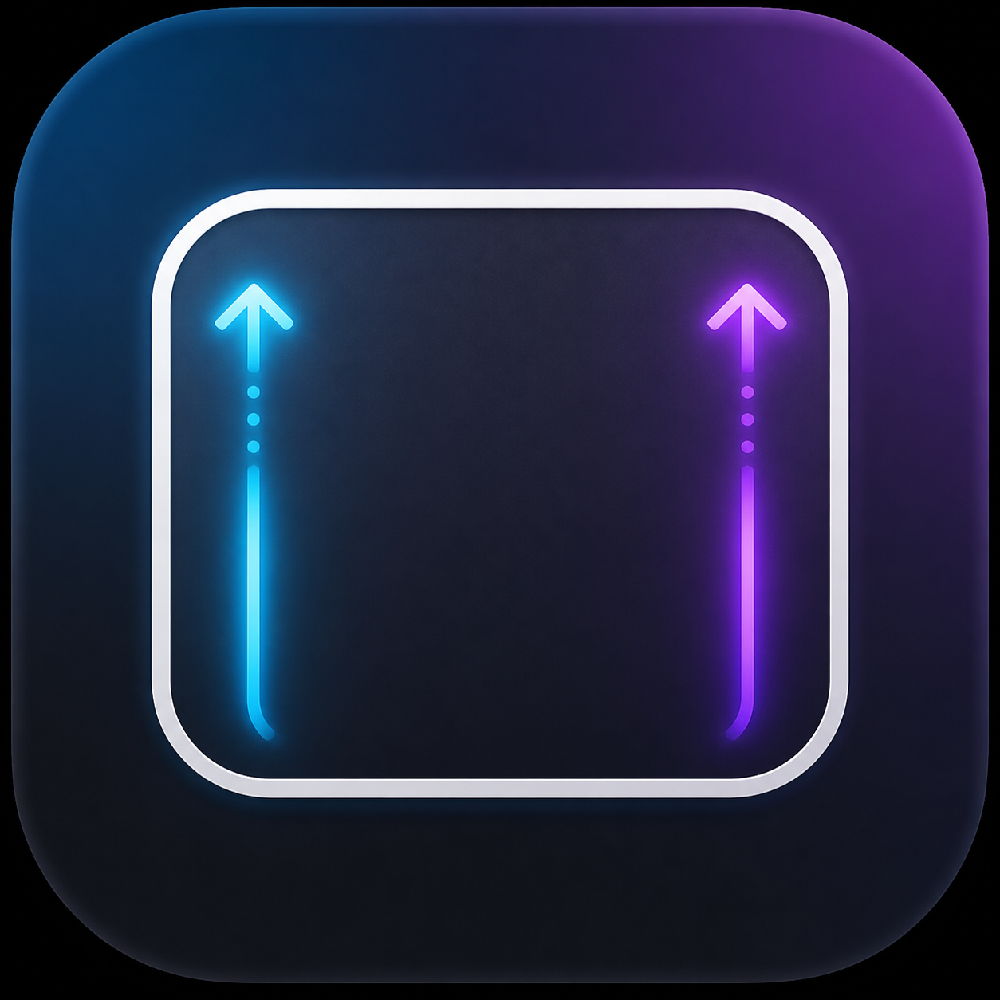
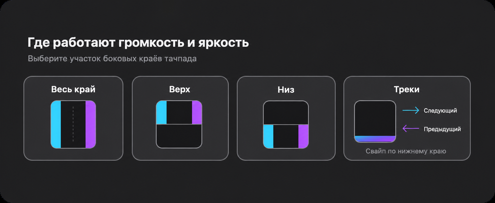

<div align="center">

#  EdgeSwipe

[](#русский) [](#english)

**Лёгкое приложение для MacBook: управляйте яркостью, громкостью и музыкой одним пальцем по краям встроенного трекпада.**




</div>

---

## Русский

## ✨ Возможности

- ☀️ **Левый край** — яркость встроенного дисплея
- 🔊 **Правый край** — системная громкость
- ⬆️ Свайп вверх увеличивает значение, вниз — уменьшает
- 🎵 **Нижний край**: слева направо — следующий трек, справа налево — предыдущий
- 🎯 Три режима зон для яркости и громкости: весь край, верхняя или нижняя половина тачпада
- 🖥️ Работает в фоне; управление и выбор зоны — из меню в строке меню macOS
- 📦 Без сторонних зависимостей

---

## ✅ Требования

- macOS 13 Ventura или новее
- MacBook со встроенным трекпадом
- Разрешения **Универсальный доступ** и **Мониторинг ввода**

## 📥 Установка из GitHub

1. Скачайте `EdgeSwipe.dmg` из [Releases](https://github.com/danilmashina/EdgeSwipe/releases).
2. Откройте образ и перетащите `EdgeSwipe.app` в папку «Программы».
3. При первом запуске используйте **Системные настройки → Конфиденциальность и безопасность → Открыть всё равно**.
4. Предоставьте приложению права в разделах **Универсальный доступ** и **Мониторинг ввода**.

## 🎮 Как пользоваться

| Жест | Действие |
|---|---|
| ⬆️ Вверх по левому краю | Увеличить яркость |
| ⬇️ Вниз по левому краю | Уменьшить яркость |
| ⬆️ Вверх по правому краю | Увеличить громкость |
| ⬇️ Вниз по правому краю | Уменьшить громкость |
| ➡️ Нижний край слева направо | Следующий трек |
| ⬅️ Нижний край справа налево | Предыдущий трек |

## 📐 Рабочая область краёв

В меню можно выбрать, где будут работать левый и правый края: **Весь край**, **Верх** (только верхняя половина) или **Низ** (только нижняя половина).

## 🛠️ Сборка из исходников

Для сборки нужен Xcode и Command Line Tools:

```
./build-installer.sh
```

## ⚠️ Важно

EdgeSwipe использует системный фреймворк macOS для чтения касаний встроенного трекпада. Поддерживаются только встроенный дисплей и встроенный трекпад MacBook; внешние мониторы и Magic Trackpad пока не поддерживаются. Приложение распространяется без Developer ID-подписи.

[⬆ Наверх](#edgeswipe)

---

## English

## ✨ Features

- ☀️ **Left edge** — built-in display brightness
- 🔊 **Right edge** — system volume
- ⬆️ Swipe up to increase, down to decrease
- 🎵 **Bottom edge**: left-to-right — next track, right-to-left — previous track
- 🎯 Three zone modes for brightness/volume: full edge, top half, or bottom half of trackpad
- 🖥️ Runs in background; control and zone selection via macOS menu bar
- 📦 No third-party dependencies

---

## ✅ Requirements

- macOS 13 Ventura or later
- MacBook with a built-in trackpad
- **Accessibility** and **Input Monitoring** permissions

## 📥 Installation from GitHub

1. Download `EdgeSwipe.dmg` from [Releases](https://github.com/danilmashina/EdgeSwipe/releases).
2. Open the disk image and drag `EdgeSwipe.app` to the Applications folder.
3. On first launch, use **System Settings → Privacy & Security → Open Anyway**.
4. Grant the app permissions under **Accessibility** and **Input Monitoring**.

## 🎮 Usage

| Gesture | Action |
|---|---|
| ⬆️ Swipe up on left edge | Increase brightness |
| ⬇️ Swipe down on left edge | Decrease brightness |
| ⬆️ Swipe up on right edge | Increase volume |
| ⬇️ Swipe down on right edge | Decrease volume |
| ➡️ Bottom edge, left to right | Next track |
| ⬅️ Bottom edge, right to left | Previous track |

## 📐 Edge Working Area

From the menu you can choose where the left and right edges are active: **Full Edge**, **Top Half**, or **Bottom Half**.

## 🛠️ Building from Source

Requires Xcode and Command Line Tools:

```
./build-installer.sh
```

## ⚠️ Important

EdgeSwipe uses a macOS system framework to read built-in trackpad touches. Only the built-in display and built-in MacBook trackpad are supported; external monitors and Magic Trackpad are not yet supported. The app is distributed without a Developer ID signature.

[⬆ Back to top](#edgeswipe)
